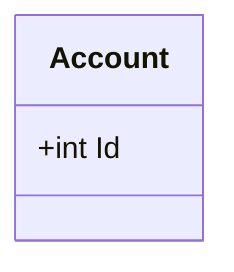
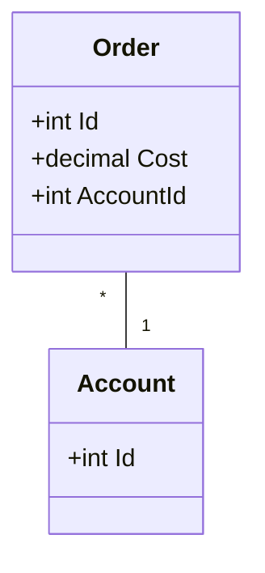

# ordering-microservices-example
This is an example application showing the usage of 2 microservices to form a basic ordering system. It also shows inter-service communication techniques both synchronous and asynchronous.

## Domain Overview

The domain consists of an Accounting service and an Ordering service. Each service is called by clients using their REST API which is exposed through an API Gateway. Services talk to each other synchronously using gRPC and asynchronously using RabbitMQ.

Each service has its own self-contained SQL Server database. Services do not and should not access the database for any other service. For this reason the Ordering SQL Server database has an Accounts table to maintain a list of Accounts to link to orders. Using synchronous and asynchronous messaging it is able to keep that table in sync with the Accounts SQL Server database.

### Accounting

The accounting service is used to manage customer accounts. An account only consists of an Id which is used as the primary key on the database table.

When a new account is created, a message is published to RabbitMQ so that any other services can keep their data in sync.

### Ordering

The ordering service is used to manage orders. An order must be linked to an Account.

When the Ordering service starts up it calls a gRPC endpoint on the Account service to retrieve the list of accounts. It then inserts any missing accounts into the Ordering SQL Server database.

While the Ordering service is running, it is listening for the RabbitMQ message that is published by the Account service whenever a new account is created. It then consumes that message and insert the new account into the Ordering SQL Server database.

## Kubernetes

The K8S folder contains the Kubernetes deployment files. Use `kubectl create` to create the resources from each file.

- `kubectl create accounting-mssql.yml`
- `kubectl create ordering-mssql.yml`
- `kubectl create rabbitmq.yml`

Wait a minute and you should be able to access the services running in Docker on your machine

| Service | Host | Port | Username | Password |
| --- | --- | --- | --- | --- |
| RabbitMQ | localhost | 15672 | guest | guest |
| Ordering MSSQL | localhost | 1434 | sa | pa55w0rd! |
| Accounting MSSQL | localhost | 1433 | sa | pa55w0rd! |

You can then either do a `dotnet run` inside the Accounting and Ordering projects or you can do a `docker build .` inside each project and upload the resulting images to Docker Hub. If you go the second route don't forget to tag the images accordingly and then update the image name inside the `accounting-service.yml` and `ordering-service.yml` deployment files before running a `kubectl create` on those files.

If running the services inside Kubernetes you will also need to `kubectl create ingress.yml` to deploy the API Gateway. You will notice that the API Gateway is using the `acme.com` host for local testing so you will need to edit your hosts file `c:\windows\system32\drivers\etc\hosts` to redirect that url to localhost by adding the following on a new line

`127.0.0.1 acme.com`

The base URL for each service is 

| Service | Local | Kubernetes |
| --- | --- | --- |
| Ordering | http://localhost:5274 | http://acme.com
| Accounting | http://localhost:5124 | http://acme.com

Endpoints for each service are as follows

| Service | Method | Name | Endpoint |
| --- | --- | --- | --- |
| Accounting | POST | CreateAccount | `/api/accounts` |
| Accounting | GET | GetAccounts | `/api/accounts` |
| Ordering | POST | CreateOrder | `/api/accounts/1/orders` |
| Ordering | GET | GetOrdersForAccount | `/api/accounts/1/orders` |
| Ordering | GET | GetOrderForAccount | `/api/accounts/1/orders/1` |

## Testing

To run the unit test suite run the following command from the root of the repository (at the solution level)

`dotnet test`